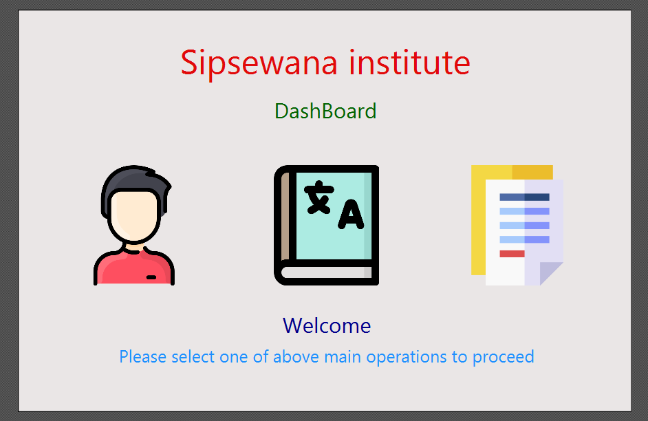
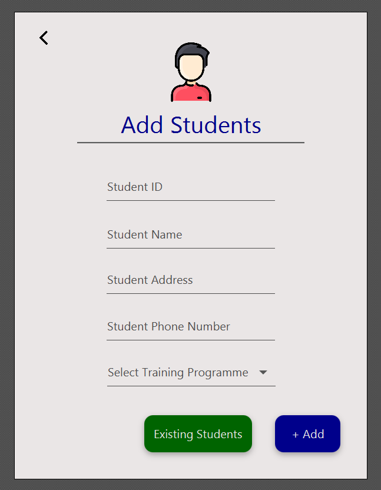

<h2 align="center">Registration Process</h2>

This project was created for the ORM module 

## <h2 align="center">Introduction</h2>

The Sipsewana institute is a prominent institute that provides different types of vocational training
    programs for the youth in Sri Lanka. The institute was established a few decades ago and now
    accommodates about 5000 students per year.
    In this institute, the student registration process was done manually so far by keeping records on
    physical files so far since its establishment. However, as the number of students keeps increasing day
    by day, management is facing more and more problems regarding keeping records of the students
    and the course programs

    

Thus, taking the advice of a consultant into account, the institution has decided to create
    a system for the registration process

    

Here a software solution to the problem had to be provided

## <h2 align="center">Roles</h2>
* Student
* Student coordinator

## <h2 align="center">Business Process</h2>
* The student visits the institution to register for a training program and has to participate in a simple interview conducted by the student coordinator
* After the interview and after the documents brought by the student are confirmed to be legit, the student coordinator proceeds with the registration
* On the registration process, the details about the student and the date of the registration and the training program he/she registered are recorded in the files
*  On registration, the student has to make the payment up-front for the respective course program
* If the student is registered to a training program already, a new registration is placed for the student ID of the old records. 
  In simple words, a student can register for multiple training programs if the situation allows it

## <h2 align="center">Functionalities</h2>
* To register students
* To add new training programs
* Toview the details of the students who registered to the training programs at the Sipsewana institute

## <h2 align="center">Languages / Frameworks / Tools / Others</h2>
* Java
* JavaFx
* MySQL
* MVC 

## <h2 align="center">Sample Screen Shots</h2>
</img>
</img>
</img>
</img>
</img>
